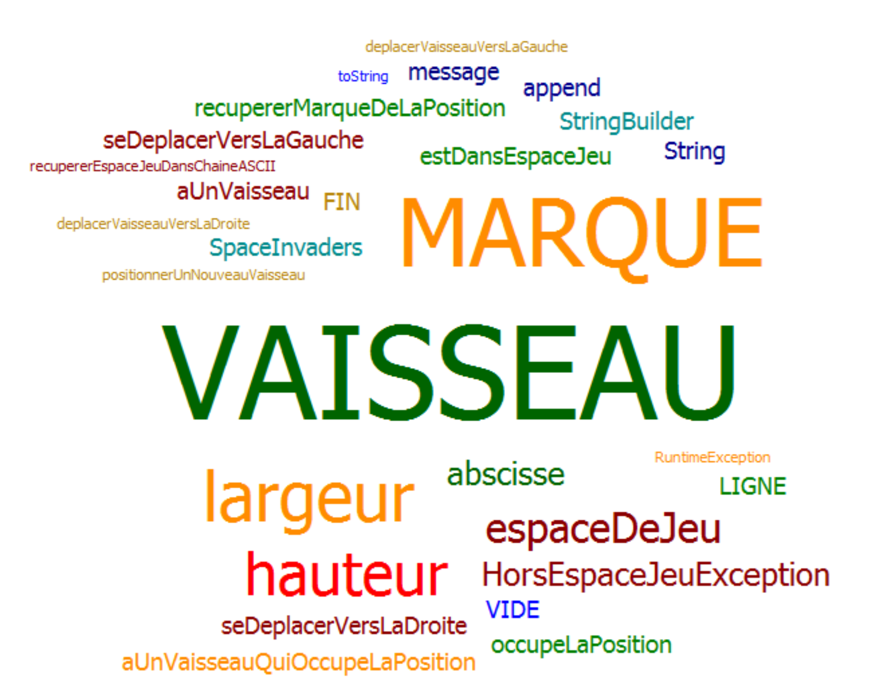
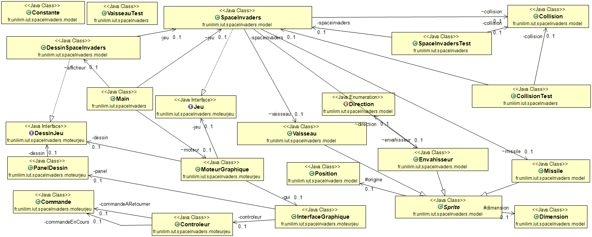

# Space-Invaders

- [Semaine n°1 : du 26 avril au 01 mai](#semaine1)  
- [Semaine n°2 : du 03 mai au 08 mai](#semaine2)
- [Semaine n°3 : du 17 mai au 22 mai](#semaine3)
- [Semaine n°4 : du 24 mai au 29 mai](#semaine4)
- [Semaine n°5 : du 01 juin au 05 juin](#semaine5)
- [Glossaire](#glossaire)

## Semaine n°1 : du 26 avril au 01 mai 

### Sprints et fonctionnalités réalisées 

#### Fonctionnalité n°1 : Déplacer un vaisseau dans l'espace de jeu (fini)
- Etape n°1 : Créer un espace de jeu  
Un espace de jeu est créé aux dimensions données (2D) 
Cet espace de jeu est vide

- Etape n°2 : Positionner un nouveau vaisseau dans l’espace de jeu  
Un nouveau vaisseau est créé
Le vaisseau est positionné aux coordonnées transmises
Si un nouveau vaisseau essaye d’être positionné en dehors des limites de l’espace jeu, alors une exception devra être levée.
 Contraintes :
La position souhaitée est transmise par ses coordonnées x et y.
Le coin supérieur gauche de l’espace jeu (point en haut à gauche) a pour coordonnées (0,0)
La taille du vaisseau est réduite pour l'instant à son minimum (1 seul point)    

- Etape n°3 : Déplacer le vaisseau vers la droite dans l'espace de jeu  
Le vaisseau se déplace d'un pas vers la droite 
Si le vaisseau se trouve sur la bordure droite de l'espace de jeu, le vaisseau doit rester immobile (aucun déplacement, aucune exception levée : le vaisseau reste juste à sa position actuelle).

- Etape n°4 : Déplacer le vaisseau vers la gauche dans l'espace de jeu  
Le vaisseau se déplace d'un pas vers la gauche 
Si le vaisseau se trouve sur la bordure gauche de l'espace de jeu, le vaisseau doit rester immobile (aucun déplacement, aucune exception levée : le vaisseau reste juste à sa position actuelle).

### Fonctionnalité en cours d’implémentation : 
Aucune

### Diagramme de classes 

### Nuage de mots du projet spaceinvaders (séance n°1)  

### Difficultés rencontrées 
Aucune

### Remarques diverses
Aucun

-------------

## Semaine n°2 : du 03 mai au 08 mai 

### Sprints et fonctionnalités réalisées 

#### Fonctionnalité n°2 : Déplacer un vaisseau dans l'espace de jeu (en-cours)
- Etape n°1 : Positionner un nouveau vanisseau avec une dimension donnée 

- Etape n°2 : Positionner un nouveau vaisseau dans l’espace de jeu     

### Fonctionnalité en cours d’implémentation : 
Fonctionnalité n°2

### Diagramme de classes 

### Nuage de mots du projet spaceinvaders

 

### Difficultés rencontrées 
Etape n°2

### Remarques diverses
Aucun

-------------

## Semaine n°3 : du 17 mai au 22 mai 

### Sprints et fonctionnalités réalisées 

#### Fonctionnalité n°2 : Déplacer un vaisseau dans l'espace de jeu (fini)
- Etape n°3 : Déplacer un vaisseau vers la droite en tenant compte de sa dimension

- Etape n°4 : Déplacer un vaisseau vers la gauche en tenant compte de sa dimension   

### Fonctionnalité en cours d’implémentation : 
Aucune

### Diagramme de classes 

### Nuage de mots du projet spaceinvaders

 

### Difficultés rencontrées 
Aucun

### Remarques diverses
Aucun

-------------

## Semaine n°4 : du 24 mai au 29 mai 

### Sprints et fonctionnalités réalisées 

#### Space Invaders - Spike : Prise en main et intégration d'un moteur graphique
- 1. Integration du code du moteur dans notre Space Invaders

- 2. Adaptation du moteur graphique à notre Space Invaders

#### Fonctionnalité n°3 : Choisir la vitesse du vaisseau
- Etape n°1 : Ajouter la vitesse au Vaisseau sans régression de comportement

- Etape n°2 : Régler la vitesse du vaisseau

- Etape n°3 : Faire en sorte que le déplacement se fasse correctement pour une vitesse quelconque

- Etape n°4 : Faire en sorte que le moteur graphique fasse bien apparaître un vaisseau avec une vitesse donnée ET
              trouver la bonne valeur pour la vitesse de votre vaisseau, celle qui sera le mieux adaptée à votre application 
              
#### Fonctionnalité n°4: Tirer un missile depuis le vaisseau
- Etape n°1 : Comprendre ce qu'est un missile et refactorer

- Etape n°2 : Comprendre ce que signifie tirer un missile depuis le vaisseau

- Etape n°3 : Pouvoir tirer un missile

- Etape n°4 : Faire déplacer le missile à la verticale de manière autonome

### Fonctionnalité en cours d’implémentation : 
Fonctionnalité 5

### Diagramme de classes 

### Nuage de mots du projet spaceinvaders

 

### Difficultés rencontrées 
Aucun

### Remarques diverses
Aucun

-------------

## Semaine n°5 : du 01 juin au 05 juin 

### Sprints et fonctionnalités réalisées 

#### Fonctionnalité n°5: Ajouter un envahisseur dans le jeu

### Fonctionnalité en cours d’implémentation : 
Aucune

### Diagramme de classes 

### Nuage de mots du projet spaceinvaders

 

### Difficultés rencontrées 
Aucun

### Remarques diverses
Aucun

-------------

## Glossaire 

* **Vaisseau** :  véhicule commandé par le joueur, pouvant se déplacer de droite à gauche et ayant la possibilité de lancer des missiles destinés à détruire le(s) envahisseurs.

* **Envahisseur**  :  ennemi qui apparaît à l'écran, se déplace automatiquement et qui doit être détruit par un missile lancé depuis le vaisseau du joueur.

* **Missile** :  projectile envoyé à la verticale par le vaisseau vers l'envahisseur dans le but de le détruire.

* **Personnage** :  Etre fictif et virtuel, contrôlé ou non par le joueur, qui apparaît dans un jeu vidéo.

* **Sprite**  :  Elément graphique qui peut se deplacer sur l'ecran. Identifie les personnages et les objets qui se superposent au fond d'ecran et qui se deplassent.

La définition des termes métiers relatifs au projet doit se trouver dans le glossaire 
Ce glossaire doit être compléter au fil des séances...

------------- 
